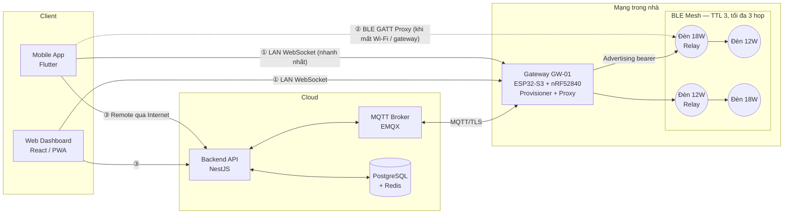

# Kiến trúc hệ thống & Stack — HomeMesh MVP

## 1. Yêu cầu kỹ thuật đầu vào

| Hạng mục | Yêu cầu |
|---|---|
| Đèn LED | 12 W và 18 W, tunable white (CCT) **2700 K – 6500 K** |
| Driver | Dual-channel PWM (kênh ấm 2700 K + kênh lạnh 6500 K), có chip BLE |
| Mạng | **BLE Mesh** (Bluetooth SIG Mesh Profile 1.0.1 / 1.1) cho toàn hệ thống |
| Gateway | Kết nối Wi-Fi/Ethernet vào mạng nhà, là cầu nối IP ↔ BLE Mesh |
| Độ trễ | **< 50 ms** từ lúc người dùng thao tác đến lúc đèn đổi trạng thái |
| Client | Web (dashboard) + App mobile (iOS/Android) |

## 2. Sơ đồ tổng thể



**Nguyên tắc cốt lõi: local-first.** Đường điều khiển nhanh (①, ②) không bao giờ đi qua cloud. Cloud chỉ phục vụ điều khiển từ xa, đồng bộ cấu hình, lịch hẹn giờ, thống kê. Round-trip Internet thường 60–160 ms nên **không thể** đạt 50 ms qua cloud.

## 3. Ba đường truyền lệnh

| # | Đường | Khi nào dùng | Độ trễ mục tiêu |
|---|---|---|---|
| ① | App → WebSocket LAN → Gateway → Mesh | Mặc định khi ở nhà, cùng Wi-Fi | **15–40 ms** |
| ② | App → BLE GATT Proxy → Mesh | Gateway offline / không có Wi-Fi | 20–50 ms |
| ③ | App → Cloud API → MQTT → Gateway → Mesh | Ở ngoài nhà | 80–200 ms (không áp 50 ms) |

App tự chọn: thử ① (mDNS `_homemesh._tcp`) → nếu lỗi thì ② → nếu ngoài nhà thì ③. Trong demo có thể đổi tay bằng nút **LAN / BLE / Cloud** và tắt gateway ở tab *Mạng Mesh*.

## 4. Ngân sách độ trễ (< 50 ms)

| Chặng | Min | Max | Ghi chú thiết kế |
|---|---:|---:|---|
| App → Gateway (WebSocket LAN) | 3 | 8 | Kết nối giữ sẵn (persistent), không HTTP request mới mỗi lệnh |
| Gateway xử lý + mã hoá AES-CCM | 1 | 3 | Hàng đợi ưu tiên: lệnh người dùng > lệnh nền |
| Phát advertising lần đầu | 3 | 10 | Network Transmit: count 2, interval 10 ms |
| Mỗi relay hop | 6 | 12 | Relay Retransmit: count 1, interval 10 ms |
| Node giải mã + cập nhật PWM | 1 | 2 | Bỏ fade mặc định khi đang kéo slider |
| **Tổng, 3 hop (2 relay)** | **20** | **47** | ✅ < 50 ms |

Ràng buộc rút ra để giữ < 50 ms:

1. **Tối đa 3 hop (TTL = 3).** Mỗi hop thêm ~6–12 ms; nhà lớn thì thêm gateway/proxy thứ 2 thay vì thêm hop.
2. **Mọi lệnh điều khiển nằm trong 1 gói unsegmented** (access payload ≤ 11 byte). `Light CTL Set` = 9 byte → 1 gói. Gói segmented phải chờ nhiều segment + Block Ack → chậm gấp nhiều lần.
3. **Điều khiển nhiều đèn = 1 gói tới group address**, không gửi N gói unicast (tránh hiệu ứng "popcorn" đèn sáng lần lượt).
4. **Node đèn scan 100 % duty cycle.** Đèn cắm điện lưới nên không cần tiết kiệm năng lượng.
5. **Kéo slider: gửi `Set Unacknowledged`, giới hạn 1 gói / 60 ms**; thả tay gửi `Set` (có ack) để chốt trạng thái cuối và cập nhật UI chuẩn.
6. **Chỉ một số node được bật Relay** (khoảng 1 relay / 3–4 đèn, chọn theo vị trí), tránh bão gói tin.

> Các con số trên là mô hình giả định để thiết kế. Phải đo lại trên phần cứng: gateway đóng dấu thời gian lúc nhận lệnh và lúc nhận `Status`, cộng thêm đo bằng photodiode + oscilloscope ở đèn cho kết quả chính xác nhất.

## 5. Stack đề xuất

### 5.1 Phần cứng & firmware

| Thành phần | Đề xuất | Lý do |
|---|---|---|
| SoC trong driver đèn | **Nordic nRF52832** (hoặc Telink TLSR8258 nếu tối ưu giá) | BLE Mesh ổn định, có PWM phần cứng nhiều kênh, giá thấp |
| Firmware đèn | **Zephyr RTOS + nRF Connect SDK** (Bluetooth Mesh stack) | Có sẵn model Light CTL Server, Scene Server, DFU |
| Gateway | **ESP32-S3** (Wi-Fi, WebSocket, MQTT) + **nRF52840** làm BLE co-processor qua UART/SPI | Tách Wi-Fi và BLE ra 2 chip, không tranh nhau anten → độ trễ ổn định. Phương án rẻ hơn: 1 chip ESP32 chạy ESP-BLE-MESH (dễ jitter hơn khi Wi-Fi tải nặng) |
| Mạch công suất | Driver dòng không đổi 2 kênh, PWM ≥ 3 kHz (tốt nhất ≥ 20 kHz) | Không nháy khi quay phim (IEEE 1789), không có tiếng rít |
| OTA | Mesh DFU (Mesh 1.1) cho đèn, OTA HTTPS cho gateway | |

### 5.2 Phần mềm

| Lớp | Đề xuất | Ghi chú |
|---|---|---|
| App mobile | **Flutter** + platform channel tới **Nordic nRF Mesh Library** (Android/iOS) | 1 code base; phần mesh (provisioning, GATT proxy) dùng thư viện native đã được kiểm chứng |
| Web | **React + Vite**, PWA | Dashboard, cấu hình, lịch; điều khiển qua WebSocket LAN hoặc cloud |
| Giao tiếp local | **WebSocket** (JSON nhỏ gọn, hoặc CBOR) trên gateway, discovery qua **mDNS** | Kết nối giữ sẵn → không tốn TCP/TLS handshake mỗi lệnh |
| Gateway ↔ Cloud | **MQTT 5 over TLS** (EMQX / Mosquitto) | Topic: `home/{homeId}/gw/{gwId}/cmd`, `.../state` |
| Backend | **Node.js (NestJS)** | Auth (JWT), quản lý nhà/phòng/thiết bị, lịch, lưu log |
| CSDL | **PostgreSQL** (cấu hình), **Redis** (trạng thái mới nhất, pub/sub) | |
| Hạ tầng | Docker Compose → sau này Kubernetes | |

### 5.3 Demo MVP trong repo này

Để thầy/nhóm xem trước luồng và UI mà **không cần phần cứng**, demo dùng HTML/CSS/JS thuần (giống các bài trước), mô phỏng tầng mesh:

| File | Vai trò |
|---|---|
| `js/cct.js` | Thuật toán màu: Kelvin → RGB hiển thị, trộn 2 kênh PWM theo thang mired, lightness perceptual → linear, ước tính công suất |
| `js/mesh.js` | Mã hoá gói BLE Mesh thật (opcode, little-endian, TID), đếm segment, mô hình độ trễ từng chặng, thống kê P95 |
| `js/data.js` | Dữ liệu mẫu: 4 phòng, 8 đèn, cây relay, 6 cảnh |
| `js/app.js` | UI, state, 3 đường truyền, provisioning, nhật ký |

Khi có phần cứng: thay hàm `transmit()` trong `app.js` bằng WebSocket tới gateway — phần còn lại của UI giữ nguyên.

## 6. Mô hình dữ liệu (backend)

```text
Home (id, name, owner_id, net_key_index, iv_index)
 ├── Gateway (id, home_id, mac, fw_version, last_seen)
 ├── Room (id, home_id, name, group_address 0xC001…)
 │    └── Light (id, room_id, uuid, unicast, model, rated_watts, relay, fw_version)
 ├── Scene (id, home_id, scene_number, name, kelvin, lightness)
 └── Schedule (id, home_id, cron, target_group, scene_id)
LightState (light_id, on, lightness, kelvin, updated_at)  ← Redis
```

Khoá mesh (NetKey, AppKey, DevKey) lưu **mã hoá** ở backend để khôi phục mạng khi đổi gateway; không bao giờ gửi xuống web client.
