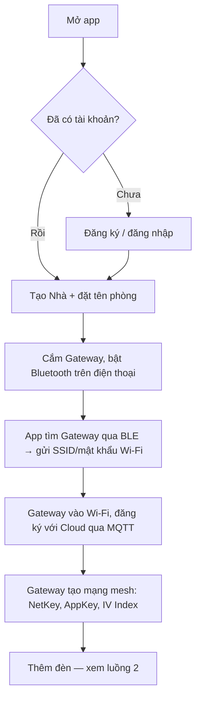
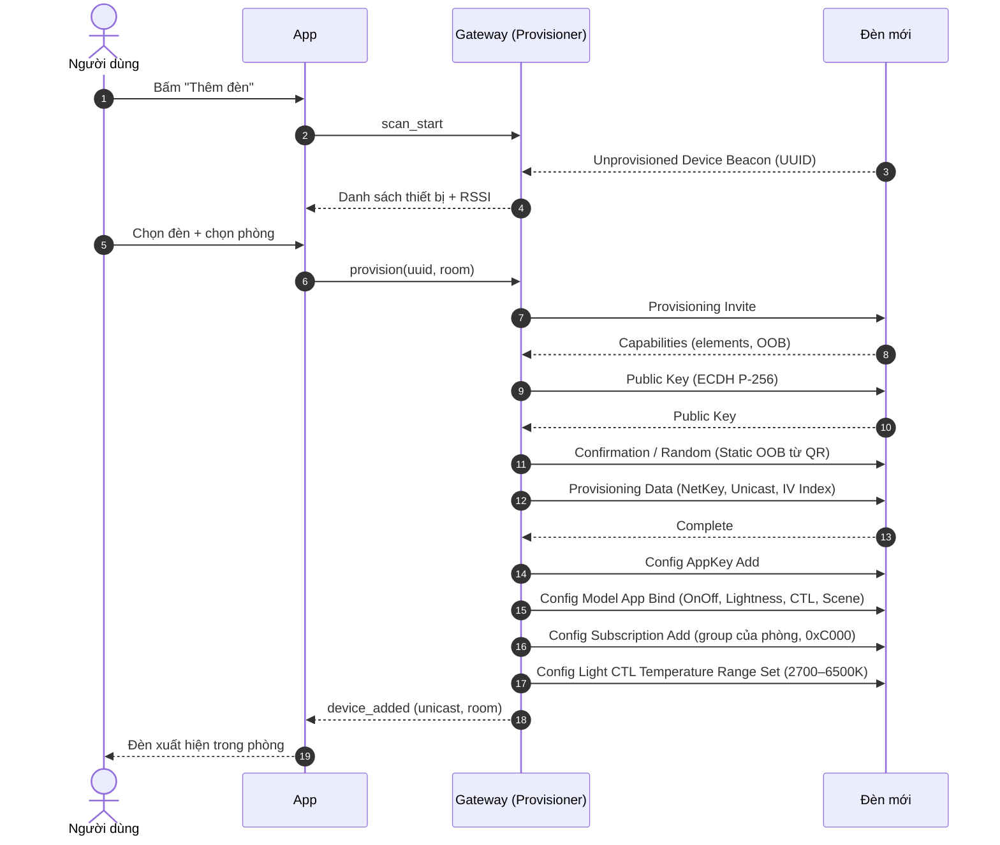
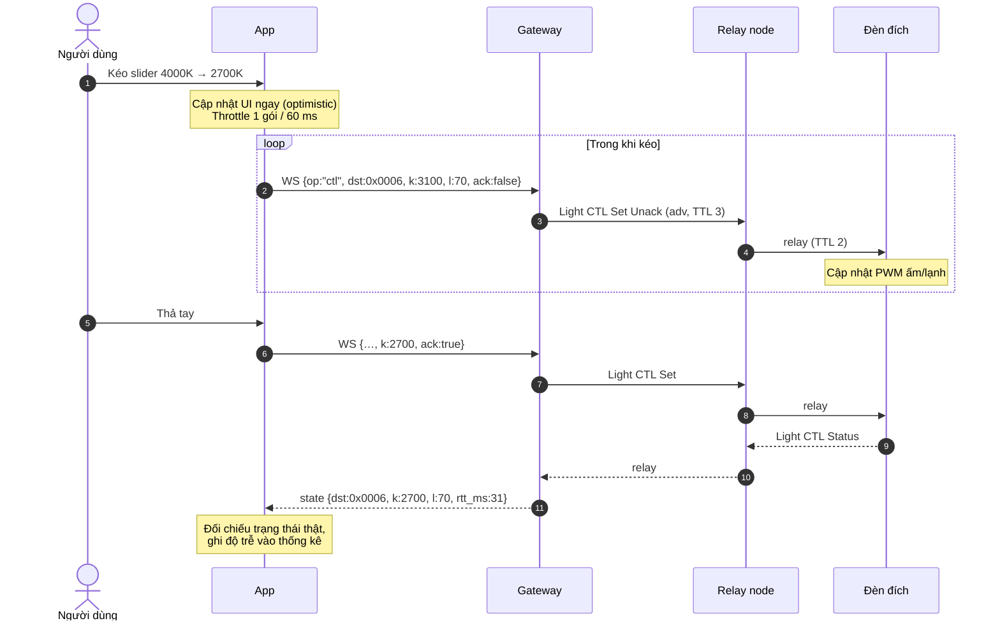
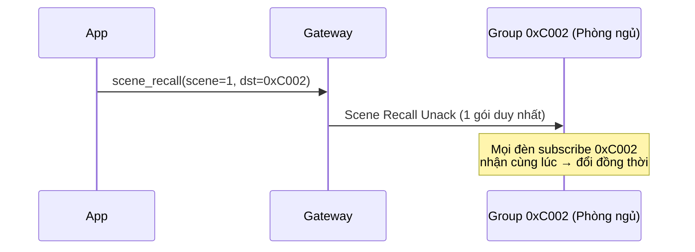
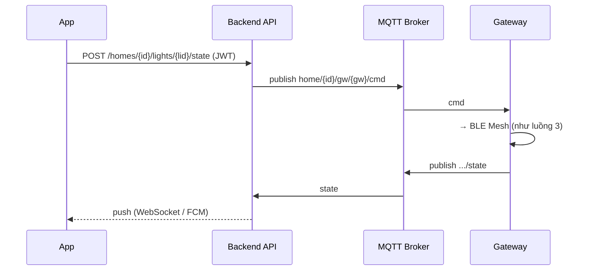

# Luồng hoạt động — HomeMesh MVP

Các sơ đồ dùng Mermaid (GitHub hiển thị trực tiếp). Mỗi luồng đều chạy được trong demo.

## 1. Onboarding lần đầu



## 2. Provisioning — thêm đèn vào mạng mesh

Demo: tab **Mạng Mesh → + Thêm đèn**.



Thời gian mục tiêu: < 10 s mỗi đèn. Hỗ trợ thêm hàng loạt: quét QR nhiều đèn rồi provision tuần tự.

## 3. Điều khiển một đèn (đường LAN, < 50 ms)

Demo: bấm một đèn → kéo **Độ sáng** / **Nhiệt độ màu**.



## 4. Điều khiển cả phòng / kịch bản (Scene)

Demo: slider **cả phòng** ở Trang chủ, hoặc tab **Cảnh**.



Scene được **lưu sẵn trong Scene Server của từng đèn** (Scene Store lúc tạo cảnh), nên khi gọi chỉ cần 1 gói 5 byte, dù phòng có bao nhiêu đèn.

## 5. Mất gateway → chuyển BLE Proxy

Demo: tab **Mạng Mesh → tắt "Gateway online"**, rồi điều khiển đèn bình thường.

```mermaid
flowchart LR
  A[Lệnh từ App] --> B{Gateway phản hồi<br/>WebSocket trong 300 ms?}
  B -- Có --> C[Gửi qua LAN]
  B -- Không --> D[Kết nối GATT tới node Proxy<br/>RSSI mạnh nhất]
  D --> E[Gửi Proxy PDU]
  E --> F[Mesh lan tới đèn]
  D --> G[Hiển thị banner:<br/>"Đang điều khiển trực tiếp qua Bluetooth"]
```

## 6. Điều khiển từ xa (Cloud)



## 7. Đồng bộ trạng thái

- Mỗi đèn **publish Light CTL Status** tới group `0xC0FF` (group giám sát) khi trạng thái đổi (kể cả do công tắc vật lý).
- Gateway giữ bảng trạng thái mới nhất, đẩy qua WebSocket cho mọi client đang mở và lên MQTT `.../state` (retained).
- App mở lên: nhận snapshot từ gateway (LAN) hoặc Redis (cloud) → không phải hỏi từng đèn.
- Heartbeat mesh mỗi 60 s để phát hiện đèn offline.
