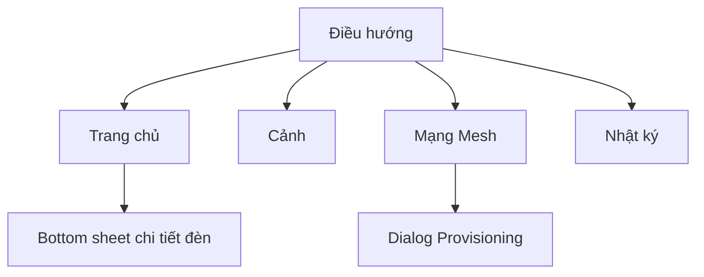

# UI / UX — HomeMesh MVP

## 1. Người dùng & mục tiêu

| Persona | Mục tiêu chính | Màn hình dùng nhiều |
|---|---|---|
| Chủ nhà | Bật/tắt, đổi màu nhanh, dùng cảnh | Trang chủ, Cảnh |
| Người cài đặt (installer) | Thêm đèn, chia phòng, kiểm tra mạng | Mạng Mesh |
| Kỹ sư / nhóm phát triển | Kiểm tra gói tin, đo độ trễ | Nhật ký, Mạng Mesh |

## 2. Nguyên tắc thiết kế

1. **Phản hồi tức thì.** UI đổi ngay khi chạm (optimistic update); trạng thái thật từ `Status` về sau sẽ đối chiếu. Người dùng không bao giờ nhìn thấy "đang tải" khi bật đèn.
2. **Màu trên màn hình = màu của đèn.** Bóng đèn trong UI phát sáng đúng nhiệt độ màu (Kelvin → RGB) và độ sáng.
3. **Thanh trượt dải màu 2700 K → 6500 K** hiển thị gradient thật, có mốc 2700 / 3500 / 4500 / 5500 / 6500 K và 5 preset có tên dễ hiểu (Ấm, Vàng nhạt, Trung tính, Trắng, Ánh ngày).
4. **Điều khiển theo phòng trước, theo đèn sau.** Mỗi phòng có công tắc + slider chung (1 gói group).
5. **Một giao diện, hai hình thái.** ≥ 760 px: dashboard web có sidebar. < 760 px: app mobile có bottom nav và bottom sheet.
6. **Luôn cho thấy độ trễ.** Pill ở góc trên hiển thị ms của lệnh cuối, xanh nếu < 50 ms, đỏ nếu vượt.

## 3. Sơ đồ màn hình

### Trang chủ
- 4 thẻ tóm tắt: số đèn bật, công suất tổng, độ trễ TB, trạng thái gateway.
- Chip lọc phòng.
- Mỗi phòng: tên + địa chỉ group, công tắc cả phòng, slider độ sáng & màu cả phòng.
- Lưới thẻ đèn: bóng đèn phát sáng theo màu, tên, `K · %`, công tắc.

### Chi tiết đèn (bottom sheet)
- Bóng đèn lớn phát sáng (preview).
- Công tắc, slider **Độ sáng**, slider **Nhiệt độ màu** (gradient), preset.
- Thông số driver: PWM kênh ấm / lạnh, công suất ước tính / định mức, mã màu.
- Thông số mesh: unicast / group, số hop, gói tin cuối (hex) + độ trễ.

### Cảnh
- Thẻ cảnh có nền glow đúng màu của cảnh. Chọn phạm vi: toàn nhà hoặc từng phòng.

### Mạng Mesh
- Sơ đồ topology: gateway, relay (viền vàng), node; gói tin "chạy" qua từng hop khi gửi lệnh.
- Thống kê độ trễ: gần nhất, TB, P95, Max, % đạt < 50 ms; biểu đồ đường với vạch 50 ms.
- Phân rã độ trễ từng chặng của lệnh gần nhất.
- Bảng node: unicast, group, hop, relay, RSSI, công suất, ping.
- Hành động: Ping toàn mạng, Stress test 100 lệnh, bật/tắt gateway, Thêm đèn.

### Nhật ký
- Bảng access message: thời gian, đường truyền, src → dst, opcode, payload hex, số segment, TTL, độ trễ. Xuất JSON.

## 4. Design tokens

| Token | Giá trị | Dùng cho |
|---|---|---|
| `--bg` | `#0E1116` | Nền (tối để ánh đèn nổi bật) |
| `--surface` / `-2` / `-3` | `#161A21` / `#1D222B` / `#262C37` | Thẻ, lớp nổi |
| `--accent` | `#FFB547` | Nút chính, công tắc bật (màu ánh đèn ấm) |
| `--ok` / `--bad` | `#3ECF8E` / `#FF6464` | Độ trễ đạt / vượt |
| Font | Be Vietnam Pro (UI), JetBrains Mono (số liệu, hex) | Hỗ trợ tiếng Việt tốt |
| Bo góc | 16 px thẻ, 10 px nút, 999 px chip | |

## 5. Trạng thái & lỗi

| Tình huống | Hiển thị |
|---|---|
| Gateway offline | Chấm đỏ ở sidebar, toast "Gateway mất kết nối → tự chuyển sang BLE GATT Proxy" |
| Lệnh vượt 50 ms | Pill đỏ, dòng nhật ký đỏ |
| Đèn không phản hồi (bản thật) | Thẻ đèn mờ + nhãn "Không phản hồi", nút thử lại |
| Chưa có đèn | Empty state + nút "Thêm đèn" |

## 6. Accessibility
- Mọi slider/công tắc là `input` thật → dùng được bằng bàn phím, trình đọc màn hình.
- Không chỉ dùng màu để báo trạng thái: luôn kèm chữ (Online/Offline, số ms).
- Tôn trọng `prefers-reduced-motion`.
- Vùng chạm ≥ 44 px trên mobile.
